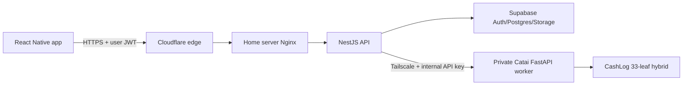
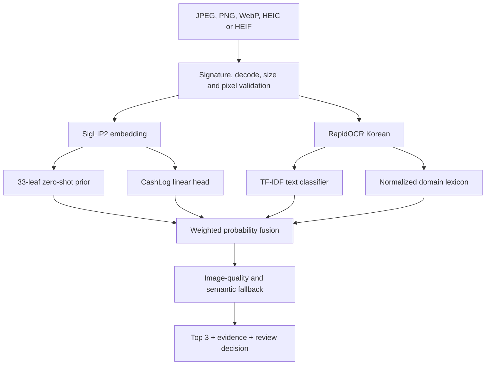

# CashLog 33-Leaf Model Design

Status: implemented, locally served, production promotion blocked by the real-photo gate
Decision date: 2026-07-17
Taxonomy version: `13.33.1`

## 1. Decision

The selected model family is `cashlog33-hybrid-v1`:

| Member | Role | Selected artifact |
|---|---|---|
| SigLIP2 base patch16 224 | Visual representation and zero-shot prior | `models/siglip2-base-patch16-224` |
| Logistic linear head | CashLog visual proxy adaptation | `checkpoints/cashlog33/vision_head_v1/vision_head.joblib` |
| RapidOCR Korean PP-OCRv5 | Korean merchant/item text extraction | `models/rapidocr/korean_PP-OCRv5_rec_mobile.onnx` |
| TF-IDF word/character SGD | Transaction and OCR text classification | `checkpoints/cashlog33/text_sgd_v2/text_model.joblib` |
| CashLog OCR lexicon | Explicit domain evidence and aliases | `configs/cashlog/ocr_lexicon.json` |

The serving artifact is checksum-pinned in
`configs/cashlog/hybrid.serving.json`. The current selection decision is
`guarded_integration_candidate`. It may recommend Top 3 categories, but it may not
auto-confirm a category. Production promotion requires a frozen, manually labeled
real-photo holdout to pass every gate in section 8.

## 2. System Boundary



The mobile app never calls the model worker directly. Cloudflare Tunnel exposes only
the home-server gateway. The AI worker listens on loopback or a Tailscale-only
interface and accepts calls only from the backend. Supabase service-role credentials
remain in NestJS and are never embedded in the app or model image.

## 3. Inference Architecture



Fusion weights are configuration, not hard-coded model behavior:

- With lexicon evidence: vision `0.25`, text `0.60`, lexicon `0.15`.
- Without lexicon evidence: vision `0.85`, text `0.15`.
- Vision itself blends zero-shot `0.30` and the trained linear head `0.70`.
- Vision/text Top-1 agreement receives a `0.10` pre-normalization bonus.

An unreadable image or a generic receipt with no category evidence falls back to
`misc_uncat`. This prevents visually plausible but unsupported labels such as a
finance category from being forced onto a blank or generic receipt.

## 4. Output Contract

The only valid labels are the 33 IDs in `configs/cashlog/categories.json`. They are
kept identical to the app's `categoryTree` leaves by contract tests.

Request, multipart form:

```http
POST /analyze-image
Content-Type: multipart/form-data
X-Internal-API-Key: <backend-only-secret>

image=<binary image>
```

The JSON form is also supported with `imageBase64`, `mimeType`, and optional
`filename`. Limits are 10 MiB decoded image, 14 MiB request, and 30 megapixels.

Response shape:

```json
{
  "success": true,
  "recommended_category": "meal_cafe",
  "confidence": 0.81,
  "top_categories": [
    {"category": "meal_cafe", "confidence": 0.81},
    {"category": "meal_drink", "confidence": 0.07},
    {"category": "meal_dining", "confidence": 0.04}
  ],
  "need_user_check": true,
  "error_code": "LOW_CONFIDENCE",
  "model": "cashlog33-hybrid-v1",
  "engine": "siglip2+rapidocr+tfidf",
  "evidence": {
    "ocr": {"text": "...", "lines": []},
    "matched_terms": {},
    "fallback_reasons": [],
    "decision_margin": 0.74
  }
}
```

`LOW_CONFIDENCE` means the app must show Top 3 or manual selection. It does not mean
the HTTP request failed. HTTP failures use status codes: `400` invalid/decode mismatch,
`401` invalid internal key, `413` size/pixel limit, and `503` unavailable artifact or
runtime.

## 5. Training I/O

| Stage | Input | Output |
|---|---|---|
| Text builder | Revision-pinned external CSV plus CashLog templates | JSONL manifest, class counts, quality report |
| Visual collector | Open Images metadata APIs/files plus category mapping | Licensed image manifest with SHA-256 and attribution |
| Visual scorer | Source-mapped manifest plus local SigLIP2 | Scored manifest and review status summary |
| Text trainer | Grouped train/validation/test JSONL | Joblib model, metrics, MLflow run |
| Vision trainer | Image manifest, scored manifest, SigLIP2 | Joblib head, metrics, MLflow run |
| Hybrid evaluator | Candidate config plus frozen manifest | Metrics, predictions, per-class report, confusion matrix |
| Selector | Checksums plus component/E2E/real metrics | Promotion decision JSON and Markdown |

Every candidate is written below `checkpoints/cashlog33/airflow_latest` and evaluated
with `configs/cashlog/hybrid.airflow-candidate.json`. Training never overwrites the
serving config. Promotion is a separate, explicit action.

## 6. Current Evidence

| Evaluation | Scope | Top-1 | Top-3 | Macro F1 |
|---|---|---:|---:|---:|
| SigLIP2 zero-shot | Open Images source-mapped proxy, 82 held-out images / 23 leaves | 0.5976 | 0.7073 | 0.5995 |
| SigLIP2 linear head | Same proxy split | 0.7927 | 0.9390 | 0.8094 |
| Text SGD | Synthetic/weak proxy, 3,876 rows / 33 leaves | 0.9972 | 0.9995 | 0.9981 |
| Full hybrid | Fixed Noto synthetic OCR integration, 99 receipts / 33 leaves | 0.9899 | 0.9899 | 0.9896 |

These numbers are not real CashLog photo accuracy. The text rows are synthetic or
weakly mapped; Open Images labels are object-to-expense proxies; rendered receipts
validate I/O and 33-label routing. The synthetic E2E ECE is about `0.2743`, so confidence is
not calibrated for automatic decisions.

## 7. Final Model Selection Rationale

The hybrid is selected over a single image backbone because CashLog category meaning
often comes from receipt text, merchant names, and transaction semantics rather than
pixels alone. The trained visual head improved Top-1 by about 19.5 percentage points
on the same proxy split, and OCR correctly routed the real app cafe canary. The
fallback layer handles missing semantic evidence explicitly. This combination has the
best available evidence while retaining a safe user-confirmation path.

Rejected alternatives and failures are recorded in `CASHLOG33_RUN_LOG.md`.

## 8. Production Promotion Gates

All gates must pass on one frozen, manually reviewed, leakage-controlled real-photo
holdout:

- At least 330 samples and at least 10 samples per each of 33 leaves.
- Top-1 at least `0.80`; Top-3 at least `0.95`; macro F1 at least `0.75`.
- Every leaf recall at least `0.60`.
- 10-bin ECE at most `0.08`.
- False auto-confirm rate at most `0.02`.
- Local CPU p95 latency at most 3 seconds.
- SHA-256 checks for every model artifact must match the candidate config.

Until those gates pass, `allow_auto_confirm` remains `false` and the server returns
Top 3 with `need_user_check=true`.
