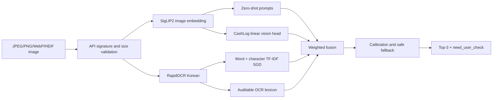
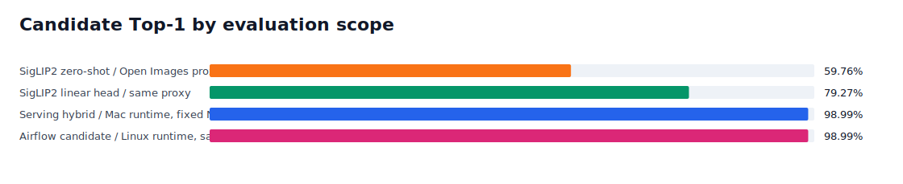
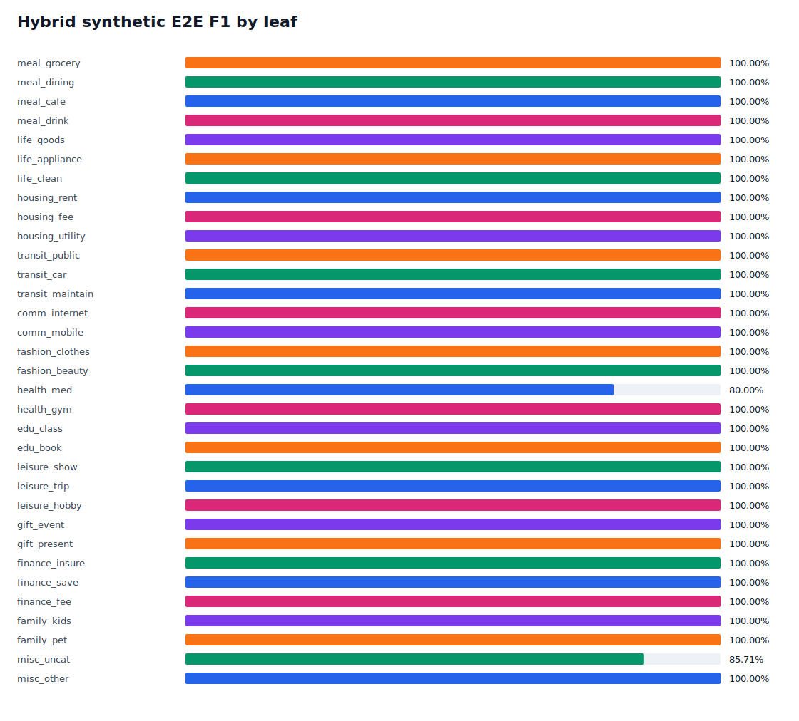
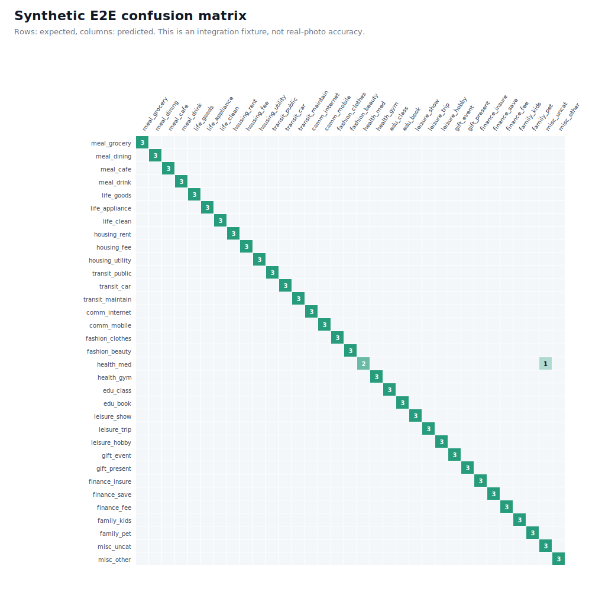
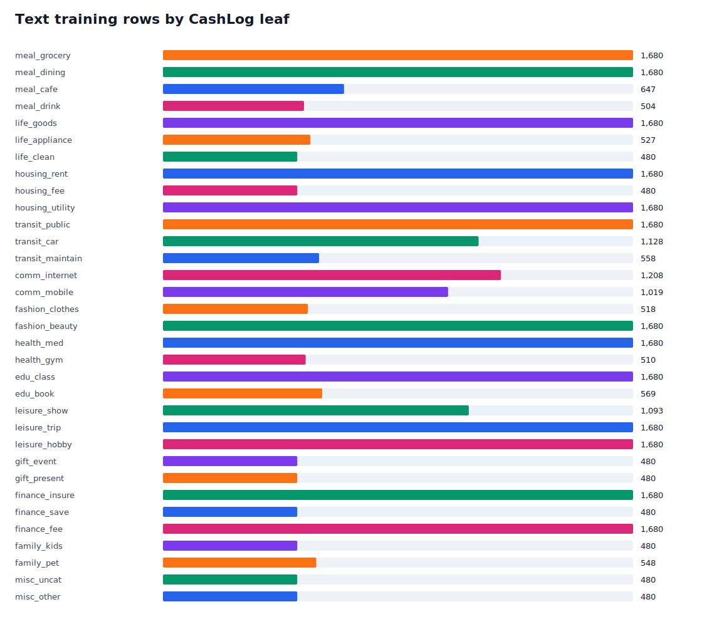

# CashLog 33-Leaf Hybrid Model Report

Generated: `2026-07-16T20:17:41.188717+00:00`
Taxonomy: `13.33.1`
Candidate: `cashlog33-hybrid-v1`
Decision: **guarded_integration_candidate**

## Technical Summary

The selected architecture is a guarded ensemble of frozen SigLIP2 image embeddings, a
CashLog-specific linear visual head, Korean RapidOCR, a word/character TF-IDF text classifier,
and an auditable merchant/keyword lexicon. It always returns three of the exact 33 leaf IDs.
Unreadable or semantically empty receipts are routed to `misc_uncat`; automatic confirmation is
disabled until a frozen real CashLog photo holdout passes all promotion gates.

This candidate is usable for **Top-3 recommendation integration**, but it is **not certified as a
production-accuracy model**. The missing evidence is a manually labeled real-photo holdout with at
least 10 photos per leaf (330 total).

## Architecture

The visual head covers 23 visually grounded leaves. Ten document/open-set leaves are supplied by
OCR/text and decision logic. `misc_uncat` is a fallback decision, not a visual object class.

## Key Results

| Evidence | Samples | Leaves | Top-1 | Top-3 | Macro F1 | Interpretation |
|---|---:|---:|---:|---:|---:|---|
| SigLIP2 zero-shot, Open Images test split | 82 | 23 | 59.76% | 70.73% | 59.95% | Visual proxy only |
| SigLIP2 linear head, same split | 82 | 23 | 79.27% | 93.90% | 80.94% | Visual proxy only |
| OCR text classifier | 3,876 | 33 | 99.72% | 99.95% | 99.81% | Synthetic/weak text proxy; inflated |
| Serving hybrid, Mac runtime on fixed Noto fixtures | 99 | 33 | 98.99% | 98.99% | 98.96% | Synthetic I/O test only |
| Airflow candidate, Linux runtime on the same fixtures | 99 | 33 | 98.99% | 98.99% | 98.96% | Synthetic reproducibility run only |

The hybrid synthetic run had false auto-confirm rate `0.00%` because
`allow_auto_confirm=false`. CPU latency was p50 `0.349s` and p95
`0.378s` after model load. Of 1 synthetic errors,
`misc_uncat` safe fallback accounted for 1 rather than forcing
an unrelated category.

The successful Airflow run was
`codex-20260717T0411KST`. Airflow
generated one fixed Noto-font manifest and both Linux and Mac runtimes evaluated those exact image
hashes. An earlier Apple-font synthetic run scored lower, showing that fixture typography affects
OCR tests. None of these synthetic runs establishes real-photo accuracy.

## Data and Provenance

| Source | Rows/images | Coverage | License/provenance | Use |
|---|---:|---:|---|---|
| Open Images V7 validation | 411 images | 23/33 | Annotations CC BY 4.0; selected image records checked as CC BY 2.0 | Visual proxy and frozen head |
| `DoDataThings/us-bank-transaction-categories-v2` revision `3e8d052cb7b362fb1a04b6064d2331982553ea56` | 18,669 rows | Broad weak mapping | MIT; SHA-256 `0424aed6e76f74a5b3b1ff61ccec43bc321622e6806da353b910b3b2c8108f6e` | Text weak supervision |
| CashLog template generator | 15,840 rows | 33/33 | Project generated | OCR lexicon and routing coverage |
| Rendered Korean receipts | 99 images | 33/33 | Project generated | End-to-end contract test |

Open Images collection dropped `4,058` images whose
source labels mapped to more than one leaf. No download failed. The Openverse smoke source is not
used for training because anonymous API collection hit 401/429 limits and candidates remained
pending human review. PD12M discovery was also excluded after the dataset API returned 500/index
loading failures.

## Input and Output Contract

Request: `POST /analyze-image`, multipart field `image`, or JSON containing `imageBase64`,
`mimeType`, and optional `filename`. Accepted signatures are JPEG, PNG, WebP, HEIC, and HEIF;
maximum size is 10 MiB. Declared MIME, extension, and binary signature must agree.

Response invariants:

- `recommended_category` is one of the exact 33 leaf IDs.
- `top_categories` contains up to three `{category, confidence}` entries.
- `need_user_check=true` means the client must not silently commit the first result.
- `error_code=LOW_CONFIDENCE` accompanies guarded decisions.
- `evidence` contains OCR lines, matched terms, component Top-3 values, image quality, fallback reason,
  and decision margin for debugging. This field should be removed or redacted at the public gateway
  if operational evidence is not intended for clients.

## Model Selection

The selected candidate is `cashlog33-hybrid-v1` because the learned visual head beats
zero-shot on the same source-group holdout, all artifacts match pinned SHA-256 values, every leaf is
routable, and the full integration test passes the configured synthetic safety gates. It is deployed
only in guarded recommendation mode.

Production promotion is denied because `real_cashlog_holdout` is missing. Required frozen-holdout
gates are Top-1 >= 80%, Top-3 >= 95%, macro F1 >= 75%, minimum per-leaf recall >= 60%, ECE <= 8%,
false auto-confirm <= 2%, and p95 <= 3 seconds. A production promotion must be explicit even after
these gates pass.

## Failure and Recovery Log

| Failure | Root cause | Action |
|---|---|---|
| EfficientNet epoch 25 stopped | Airflow heartbeat timeout after best Top-1 88.60% on the old four-leaf task | Metrics retained; old run rejected for 33-leaf use |
| ConvNeXt exited 137 | Host memory pressure/OOM | Removed from current candidate; frozen embeddings + linear head used |
| Initial MLflow artifact upload failed | Server advertised read-only `/workspace` artifact URI | Enabled MLflow artifact proxy with `mlflow-artifacts:/` |
| Openverse full collection stopped | Anonymous 401/429 | Pending smoke rows excluded; Open Images official metadata used |
| PD12M discovery failed | HF dataset API 500/index loading | Excluded; failure documented |
| Generic receipt predicted `finance_fee` | OCR lost every semantic line and text model learned generic payment tokens | Added normalized display-name matching and `misc_uncat` safe fallback |
| Airflow vision-head attempt exited 137 | All 1,068 augmented PIL views were retained in memory before embedding | Replaced eager loading with bounded batch streaming and reduced Airflow batch to 4 |

## Monitoring and Operations

- Airflow: `http://127.0.0.1:8080`, DAG `cashlog33_training_pipeline`
- MLflow: `http://127.0.0.1:5500`, experiment `cashlog33-hybrid-v2`
- Jenkins: `http://127.0.0.1:8081`; credential ID `airflow-local-basic`
- API: `http://127.0.0.1:8010/health`
- Training progress: each text candidate writes `progress.json`; Airflow task logs provide stage state;
  MLflow stores parameters, metrics, status, and artifacts.

Airflow writes to `airflow_latest` candidate paths and never overwrites the pinned serving config.
Jenkins triggers and polls Airflow through its internal API and does not mount the Docker socket.

## Limitations and Robustness

- There is no frozen real CashLog photo holdout yet; no current percentage is a real app accuracy claim.
- Open Images labels identify objects, not financial intent. A phone photo cannot distinguish buying a
  phone from paying a phone bill without receipt/merchant context.
- Synthetic text and rendered receipts share vocabulary with the lexicon and therefore overestimate
  OCR/text performance.
- Current inference is CPU-oriented and loads roughly 1.4 GiB of SigLIP2 weights. Phone ONNX export
  is not the selected serving path; the Mac/home worker should run inference behind the private link.
- User correction events must include model version, Top-3, chosen leaf, image consent/retention state,
  and a stable de-identified sample ID before they can enter retraining.

## Next Evidence Required

1. Freeze at least 330 consented real photos, 10 or more for every leaf; 30 per leaf is preferred.
2. Keep the test split sealed and group repeated merchants/users to prevent leakage.
3. Run the same evaluator and store overall, per-leaf, calibration, latency, and auto-confirm metrics.
4. Review the lowest-recall leaves, add only licensed or consented training data, retrain an isolated
   candidate, and compare on the unchanged holdout.
5. Enable automatic confirmation only after the real-photo gates pass and the release is approved.

## 33-Leaf Coverage

| Leaf ID | Group | Display name | Text rows |
|---|---|---|---:|
| `meal_grocery` | 식사 | 식재료 | 1,680 |
| `meal_dining` | 식사 | 외식·배달 | 1,680 |
| `meal_cafe` | 식사 | 카페·디저트 | 647 |
| `meal_drink` | 식사 | 술·음료 | 504 |
| `life_goods` | 생활 | 생활용품 | 1,680 |
| `life_appliance` | 생활 | 가전·가구 | 527 |
| `life_clean` | 생활 | 세탁·청소 | 480 |
| `housing_rent` | 주거 | 월세·전세 | 1,680 |
| `housing_fee` | 주거 | 관리비 | 480 |
| `housing_utility` | 주거 | 공과금 | 1,680 |
| `transit_public` | 교통 | 대중교통 | 1,680 |
| `transit_car` | 교통 | 택시·주차·유류 | 1,128 |
| `transit_maintain` | 교통 | 자동차유지 | 558 |
| `comm_internet` | 통신 | 인터넷·TV | 1,208 |
| `comm_mobile` | 통신 | 휴대폰 | 1,019 |
| `fashion_clothes` | 의류/미용 | 의류 | 518 |
| `fashion_beauty` | 의류/미용 | 미용·화장품 | 1,680 |
| `health_med` | 건강 | 약·병원 | 1,680 |
| `health_gym` | 건강 | 운동·헬스 | 510 |
| `edu_class` | 교육 | 학원·강의 | 1,680 |
| `edu_book` | 교육 | 도서·문구 | 569 |
| `leisure_show` | 문화/여가 | 영화·공연·전시 | 1,093 |
| `leisure_trip` | 문화/여가 | 여행 | 1,680 |
| `leisure_hobby` | 문화/여가 | 취미 | 1,680 |
| `gift_event` | 경조사/선물 | 경조사 | 480 |
| `gift_present` | 경조사/선물 | 선물 | 480 |
| `finance_insure` | 금융/저축 | 보험 | 1,680 |
| `finance_save` | 금융/저축 | 저축·투자 | 480 |
| `finance_fee` | 금융/저축 | 이자·수수료 | 1,680 |
| `family_kids` | 반려/육아 | 육아 | 480 |
| `family_pet` | 반려/육아 | 반려동물 | 548 |
| `misc_uncat` | 기타 | 미분류 | 480 |
| `misc_other` | 기타 | 기타 | 480 |
